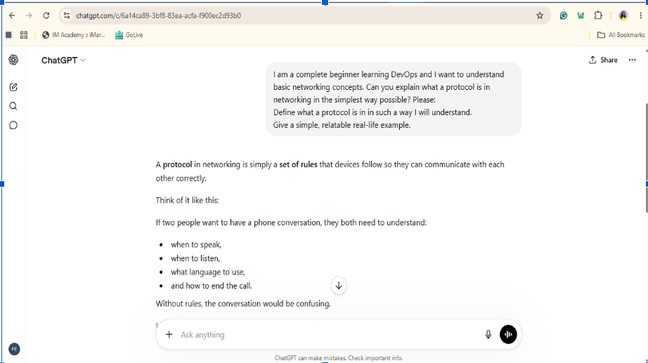
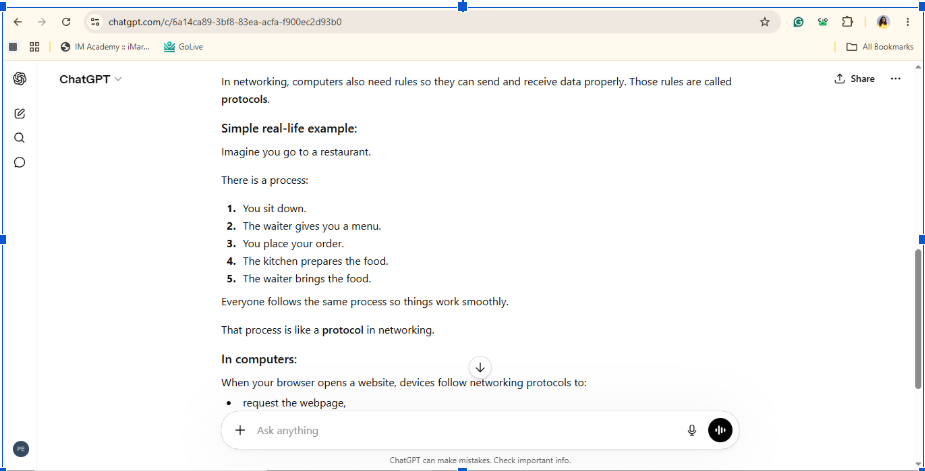
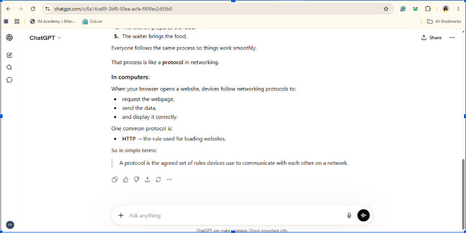
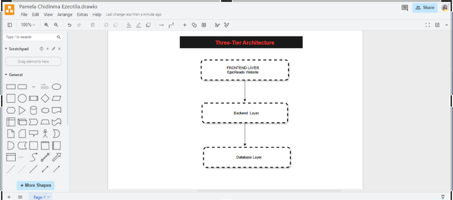
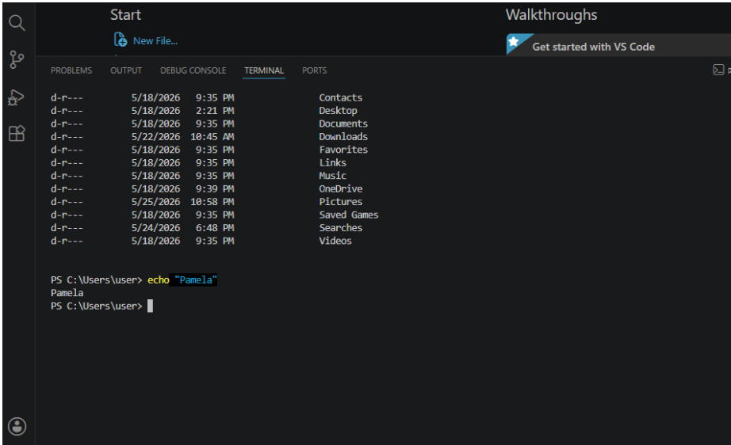

# Week 00 - Internet and Networking

Part of the DevOps Micro Internship (DMI) Cohort 3 with Agentic AI

---

# 🧑‍💻 Task 1: Using ChatGPT as Your Learning Assistant

## Scenario

You're new to DevOps and will frequently encounter technical questions. ChatGPT can be your learning companion.

## Your Task

Write a clear ChatGPT prompt to help you understand:

> "What is a protocol in networking? Explain with a simple real-life example."

Take a screenshot of your interaction showing:

* Your detailed prompt (with clear expectations)
* ChatGPT's simplified response with an example

## Screenshot

Save your screenshot in the `screenshots` folder and update the file name below.





Replace `task-1-chatgpt.png` with your actual screenshot file name.

---

## What I Learned (2–3 lines)

I learned that writing a clear prompt helps ChatGPT give better answers. I also learned that ChatGPT can explain technical topics in simple English with real-life examples, which makes learning easier.

---

# 🌐 Task 2: Internet and Networking

## Scenario

Your friend is launching an online bookstore named **EpicReads**.

He asked you to explain how users globally can access his website hosted in Finland.

## Your Task

Write a short explanation (**100–150 words**) that includes:

* Packet Switching
* IP Address
* TCP/IP
* HTTP/HTTPS

💡 **Tip:** You may use ChatGPT (as demonstrated in Task 1) to refine your explanation.

## Answer

When someone visits epicreads.com, their request is broken into small pieces called packets. This process is called packet switching. The packets travel across the internet to the server in Finland using the server's IP address, which is the unique address of the server. TCP/IP makes sure the packets are delivered correctly and in the right order. When the packets reach the server, HTTP or HTTPS is used to request and deliver the website. HTTPS is more secure because it encrypts the data sent between the user's browser and the server. Finally, the server sends the website back to the user, allowing people from anywhere in the world to access EpicReads.

---

# 🏗️ Task 3: Application Architecture & Stack

## Scenario

EpicReads bookstore has two application versions:

### Two-Tier Application

* Frontend
* Database

### Three-Tier Application

* Frontend
* Backend
* Database

## Your Task

* Draw simple diagrams (hand-drawn or tool-based such as draw.io)
* Label each layer clearly
* List at least two common technologies or tools used for each layer
* Submit a screenshot or photo clearly showing your own drawing

## Diagram Screenshot / Photo

Save your diagram image in the `screenshots` folder and update the file name below.




Replace `task-3-diagram.png` with your actual diagram file name.

---

## Technologies Used

### Frontend

* HTML
* React

### Backend

* Express.js
* Node.js

### Database

* MySQL
* MongoDB

---

# 🌍 Task 4: Domain Name & DNS (Basic Concepts)

## Scenario

Your friend's bookstore **EpicReads** is currently accessible through:

```text
52.172.142.222:3000
```

He purchased the domain:

```text
epicreads.com
```

## Your Task

In **50–100 words**, explain in your own words:

1. What is DNS (Domain Name System)?
2. Which DNS record type should be used to connect the domain to the given IP, and why?

## Answer

DNS (Domain Name System) changes a domain name, such as epicreads.com, into an IP address that computers can understand. This allows users to access a website by typing its name instead of remembering numbers. To connect the domain to the IP address 52.172.142.222, an A record is used because it maps a domain name directly to an IPv4 address.

---

# 💻 Task 5: Visual Studio Code Setup (Hands-on)

## Your Task

Install Visual Studio Code (if not already installed).

Take a screenshot of your VS Code environment showing:

* Terminal open inside VS Code
* Running a basic command:

### Windows

```powershell
dir
```

### Linux / macOS

```bash
pwd
ls
```

* Your selected VS Code theme clearly visible

⚠️ **Important:** The screenshot must show your username or another identifiable detail to confirm it is your environment.

## Screenshot

Save your screenshot in the `screenshots` folder and update the file name below.




Replace `task-5-vscode.png` with your actual screenshot file name.

---

# 🔗 Task 6: Publish Your Assignment as a LinkedIn Post

## Objective

Publishing on LinkedIn helps you:

* Build your professional online presence
* Reinforce your learning
* Document your DevOps journey publicly

## Your Task

Summarize your answers from Tasks 1–5 into a LinkedIn post.

Clearly structure your post into the following sections:

* ChatGPT
* Internet & Networking
* App Architecture
* DNS
* VS Code Setup

Add the following credit note at the end of your post:

> **P.S. This post is part of the DevOps Micro Internship (DMI) with Agentic AI — Cohort 3 — by Pravin Mishra. My graded progress is public: https://dmi.pravinmishra.com/s/YOUR-GITHUB-USERNAME.html · Start your DevOps journey: https://dmi.pravinmishra.com/?utm_source=student&utm_medium=ps-linkedin&utm_campaign=cohort3**

---

## LinkedIn Post URL

Paste your LinkedIn post URL here:

```text
https://www.linkedin.com/posts/pamela-ezeotika_devops-micro-internship-dmi-by-pravin-activity-7465375946863308801-r3Fa?utm_source=share&utm_medium=member_desktop&rcm=ACoAAEDjJUYBrDNdac3TpJMBKPF08Q4-AeIrB8E
```

---

## LinkedIn Post Backup Copy

Paste the full text of your LinkedIn post here:

This week I completed my Week 0 Assignment for the DevOps Micro Internship and here is everything I learned 👇


👉 𝗖𝗵𝗮𝘁𝗚𝗣𝗧 𝗮𝘀 𝗮 𝗟𝗲𝗮𝗿𝗻𝗶𝗻𝗴 𝗧𝗼𝗼𝗹 I learned how to write detailed, structured prompts to get clear and beginner-friendly explanations from ChatGPT. Instead of asking vague questions, a good prompt sets the context, asks for examples, and specifies the audience level. This skill alone will make learning any technical concept faster and easier.


👉𝐈𝐧𝐭𝐞𝐫𝐧𝐞𝐭 & 𝐍𝐞𝐭𝐰𝐨𝐫𝐤𝐢𝐧𝐠 I learned how the internet actually works behind the scenes. When you visit a website, your request is broken into small pieces called Packet Switching, routed using your device's IP Address, delivered safely using TCP/IP, and displayed in your browser using HTTP/HTTPS. All of this happens in milliseconds every time you open a webpage!


👉 𝐀𝐩𝐩𝐥𝐢𝐜𝐚𝐭𝐢𝐨𝐧 𝐀𝐫𝐜𝐡𝐢𝐭𝐞𝐜𝐭𝐮𝐫𝐞 I explored two ways to build an app: 

Two-Tier (Frontend + Database) simple and direct. 

Three-Tier (Frontend + Backend + Database) more scalable and secure


👉 𝐃𝐍𝐒 typing an IP address like 52.172.142.222 to visit a website, you just type epicreads.com and DNS connects the two. To link a domain to an IP address, you use an A Record.

👉 𝐕𝐒 𝐂𝐨𝐝𝐞 𝐒𝐞𝐭𝐮𝐩 I installed Visual Studio Code, opened the terminal, and ran some commands.


Every big journey starts with Week 0. I am just getting started 🚀


𝐏.𝐒. This post is part of the FREE DevOps Micro Internship Cohort run by Pravin Mishra. You can start your DevOps journey for free from his YouTube Playlist https://lnkd.in/e7mBgDg6


hashtag#DevOps hashtag#AWS hashtag#CloudEngineering hashtag#Kubernetes hashtag#LearningInPublic hashtag#VSCode hashtag#Networking hashtag#DNS

---

# Reflection – Week 0

### What did you find easy?

I found it easy to use ChatGPT to understand new topics, learn basic networking concepts, and identify the different layers of application architecture.

---

### What was difficult?

Understanding how networking concepts like TCP/IP, packet switching, and DNS work together was a bit challenging at first. I also needed some time to understand the difference between two-tier and three-tier applications.

---

### What will you improve next week?

Next week, I will spend more time practicing the concepts I learned. I also want to improve my understanding of networking and become more confident using DevOps tools and commands.

---

## 📌 About DMI & CloudAdvisory

DevOps Micro Internship (DMI) is a project-based DevOps program run by Pravin Mishra (The CloudAdvisory) focused on real-world execution, systems thinking, and career readiness.

It helps learners build strong DevOps foundations with hands-on experience.


## 📌 Resources

- 🌐 **DMI Official Website:** https://pravinmishra.com/dmi  
- 🎓 **DevOps for Beginners (Udemy):** https://www.udemy.com/course/devops-for-beginners-docker-k8s-cloud-cicd-4-projects/  
- 🎓 **Ultimate Agentic AI DevOps with Clude Code** https://www.udemy.com/course/ultimate-agentic-ai-devops-with-claude-code/?referralCode=448389767BC96284087B
- 🎓 **DevOps with Claude Code: Terraform, EKS, ArgoCD & Helm** https://www.udemy.com/course/devops-with-claude-code-terraform-eks-argocd-helm/?referralCode=1C5B734505D65A010FA3
- ▶️ **YouTube Playlist (DMI Cohort 3):** https://www.youtube.com/playlist?list=PLFeSNDtI4Cho  
- 🔗 **Pravin Mishra (LinkedIn):** https://www.linkedin.com/in/pravin-mishra-aws-trainer/  
- 🏢 **CloudAdvisory (LinkedIn):** https://www.linkedin.com/company/thecloudadvisory/

---

*This submission is part of DevOps Micro Internship (DMI) Cohort 3 — Agentic AI Track*