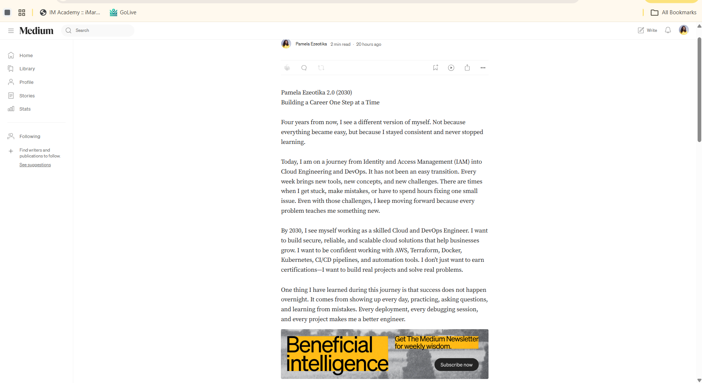
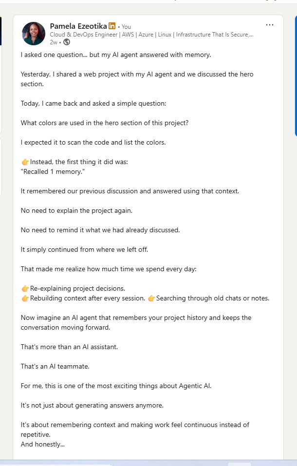

# Assignment 8 — Week 2 Reflection Blog

Part of the DevOps Micro Internship (DMI) Cohort 3 with Agentic AI

---

# Purpose

In this assignment, you will reflect on your Week 2 learning journey and write a short blog capturing your experience working with Agentic AI tools such as Claude Code, Skills, Subagents, MCP, Hooks, Permissions, and Memory.

You will also publish a LinkedIn post summarizing your learning and share both links for evaluation.

---

# Task 1 — Write Your Reflection Blog

## Goal

Write a reflection blog covering your Week 2 learning experience.

### Blog Requirements

Your blog must include:

* Title: **Reflection – Week 2**
* Minimum 300 words
* At least 2–3 topics from Week 2 (Claude Code, Skills, Subagents, MCP, Hooks, Permissions, Memory)
* Honest personal reflection (learning, challenges, mindset)
* One habit/system you plan to implement
* Your full name clearly visible

### Allowed Platforms

You can publish your blog on:

* Hashnode
* Medium
* Dev.to
* LinkedIn Article
* GitHub Markdown file
* Substack

---

### Evidence

#### Screenshot 1 — Blog published and visible

---

### Submission Field

Blog Link:

 |https://www.linkedin.com/posts/pamela-ezeotika_dmibypravinmishra-agenticai-claudecode-activity-7481442780196569088-ZyQH?utm_source=share&utm_medium=member_desktop&rcm=ACoAAEDjJUYBrDNdac3TpJMBKPF08Q4-AeIrB8E | https://medium.com/@ezeotikapamela/reflection-week-2-learning-how-ai-can-do-more-than-answer-questions-by-pamela-chidinma-ezeotika-adadc001aa32 

---

# Task 2 — Create LinkedIn Post

## Goal

Share your Week 2 learning publicly on LinkedIn.

---

### LinkedIn Post Requirements

Your post must include:

* One screenshot from any Week 2 assignment
* Short reflection (what you learned or built)
* Required P.S. line exactly as given below

---

### Required P.S. Line (Must Include Exactly)

> **P.S. This post is part of the DevOps Micro Internship (DMI) with Agentic AI — Cohort 3 — by [Pravin Mishra](https://www.linkedin.com/in/pravin-mishra-aws-trainer/). My graded progress is public: https://dmi.pravinmishra.com/s/YOUR-GITHUB-USERNAME.html · Start your DevOps journey: https://dmi.pravinmishra.com/?utm_source=student&utm_medium=ps-linkedin&utm_campaign=cohort3**

---

### Suggested Hashtags

#DMIByPravinMishra #AgenticAI #ClaudeCode #DevOps #LearningInPublic

---

### Evidence

#### Screenshot 2 — LinkedIn post published

---

### Submission Field

LinkedIn Post Content (copy-paste here):

I asked one question... but my AI agent answered with memory.

Yesterday, I shared a web project with my AI agent and we discussed the hero section.

Today, I came back and asked a simple question:

What colors are used in the hero section of this project?

I expected it to scan the code and list the colors.

👉Instead, the first thing it did was:
"Recalled 1 memory."

It remembered our previous discussion and answered using that context.

No need to explain the project again.

No need to remind it what we had already discussed.

It simply continued from where we left off.

That made me realize how much time we spend every day:

👉Re-explaining project decisions. 
👉Rebuilding context after every session. 👉Searching through old chats or notes.

Now imagine an AI agent that remembers your project history and keeps the conversation moving forward.

That's more than an AI assistant.

That's an AI teammate.

For me, this is one of the most exciting things about Agentic AI.

It's not just about generating answers anymore.

It's about remembering context and making work feel continuous instead of repetitive.
And honestly...

I think we're only scratching the surface of what's possible.

P.S. This post is a part of DevOps Microy Internship with Agentic AI Cohort-3 by Pravin Mishra. You can start your DevOps journey by joining this Discord community (https://lnkd.in/eCJYseYp).

hashtag#DMIByPravinMishra hashtag#AgenticAI hashtag#ClaudeCode hashtag#DevOps hashtag#LearningInPublic hashtag#AI hashtag#CloudComputing

---

### LinkedIn Post Link:

https://www.linkedin.com/posts/pamela-ezeotika_dmibypravinmishra-agenticai-claudecode-activity-7481442780196569088-ZyQH?utm_source=share&utm_medium=member_desktop&rcm=ACoAAEDjJUYBrDNdac3TpJMBKPF08Q4-AeIrB8E

---

# Submission Instructions

* Blog must be publicly accessible
* LinkedIn post must be visible (public or unlisted where applicable)
* All required fields must be filled
* Screenshot proofs must be added to GitHub repository
* Do not include sensitive information in blog or post

---

# Completion Checklist

* [x] Blog written with required structure
* [x] Blog includes at least 2–3 Week 2 topics
* [x] Blog is publicly accessible
* [x] LinkedIn post created
* [x] Required P.S. line included
* [x] LinkedIn post content copied in submission field
* [x] Blog link added
* [x] LinkedIn post link added
* [x] Screenshots added to GitHub repo

---

# About DMI & CloudAdvisory

DevOps Micro Internship (DMI) is a project-based DevOps program run by Pravin Mishra (The CloudAdvisory), focused on real-world execution, systems thinking, and agentic AI workflows.

It helps learners build strong DevOps foundations through hands-on experience.

---

# Resources

* 🌐 DMI Official Website: [https://dmi.pravinmishra.com?utm_source=github&utm_medium=readme](https://dmi.pravinmishra.com?utm_source=github&utm_medium=readme)
* 🎓 University: [https://university.pravinmishra.com?utm_source=github&utm_medium=readme](https://university.pravinmishra.com?utm_source=github&utm_medium=readme)
* 💬 Discord Community: [https://discord.pravinmishra.com?utm_source=github&utm_medium=readme](https://discord.pravinmishra.com?utm_source=github&utm_medium=readme)
* 📝 Blog: [https://dmi.pravinmishra.com/blog?utm_source=github&utm_medium=readme](https://dmi.pravinmishra.com/blog?utm_source=github&utm_medium=readme)
* ▶️ YouTube Playlist: [https://www.youtube.com/playlist?list=PLFeSNDtI4Cho](https://www.youtube.com/playlist?list=PLFeSNDtI4Cho)
* 🔗 Pravin Mishra (LinkedIn): [https://www.linkedin.com/in/pravin-mishra-aws-trainer/](https://www.linkedin.com/in/pravin-mishra-aws-trainer/)
* 🏢 CloudAdvisory (LinkedIn): [https://www.linkedin.com/company/thecloudadvisory/](https://www.linkedin.com/company/thecloudadvisory/)

