# Assignment 3 — Production Maintenance Drill (OPS Checklist)

Part of the DevOps Micro Internship (DMI) Cohort 3 with Agentic AI

---

## Purpose

In this assignment, you will treat your already deployed React application (on Ubuntu VM with Nginx) as a live production system. You will perform structured operational checks covering network validation, service health, log analysis, resource monitoring, configuration verification, and incident simulation with recovery — mirroring real on-call DevOps responsibilities.

---

# Task 1 — Server Access & Networking Validation

## Goal

Verify that the deployed React application is reachable from the browser and confirm basic network connectivity of the Ubuntu VM.

### Evidence

#### Screenshot 1 — Browser showing the React app with your Full Name visible on the UI

---

#### Screenshot 2 — Output of `ip a`

---

#### Screenshot 3 — Output of `sudo ss -tulpen`

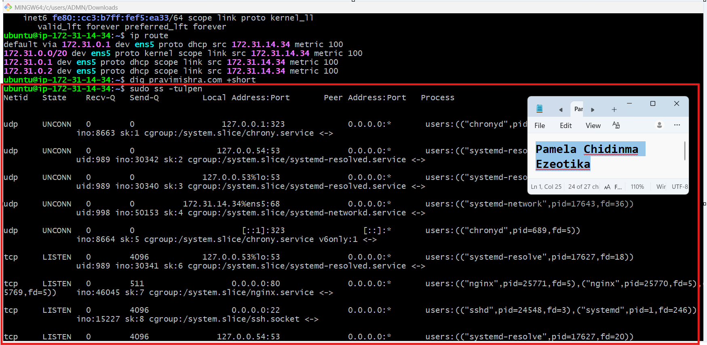

---

#### Screenshot 4 — Output of `sudo ufw status`

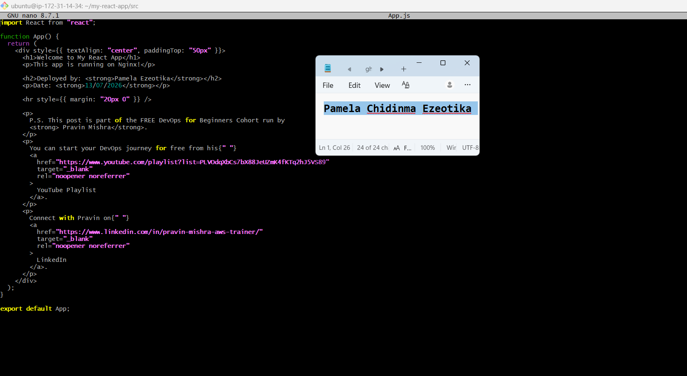

---

### Notes

Answer the following in your own words:

**1. What proves Nginx is listening on 0.0.0.0:80?**

The output shows that Nginx is listening on 0.0.0.0:80. This means it is accepting HTTP connections on port 80 from any network interface.

---

**2. What proves SSH is active on port 22?**

The ss -tulpn output shows 0.0.0.0:80 with the nginx process. This confirms that Nginx is listening on port 80 and can accept connections from any network interface.

---

**3. Did you find any unexpected open ports? Explain briefly.**

No. I only found the expected ports, such as 80 for Nginx and 22 for SSH. The other ports shown are used by system services like DNS and time synchronization, so there were no unexpected open ports.

---

# Task 2 — Service Health & Systemd Validation (Nginx)

## Goal

Verify that Nginx is properly installed, running, enabled at boot, and safely configured.

### Evidence

#### Screenshot 1 — Output of `systemctl status nginx --no-pager`

---

#### Screenshot 2 — Output of `sudo nginx -t`

---

#### Screenshot 3 — Output of `sudo ss -lptn '( sport = :80 )'`

---

### Notes

Answer the following in your own words:

**1. What happens if Nginx fails to restart in production?**

If Nginx fails to restart, the website or application may become unavailable. Users may not be able to access the service until the problem is fixed and Nginx starts running again.

---

**2. What's your basic rollback plan?**

If the restart fails, I will restore the previous Nginx configuration, test it to make sure it is correct, and then restart Nginx again. This helps bring the website back online as quickly as possible.

---

# Task 3 — Logs & Request Trace

## Goal

Verify real traffic flow and analyze logs to understand system behavior and errors.

### Evidence

#### Screenshot 1 — Output of `sudo tail -n 30 /var/log/nginx/access.log`

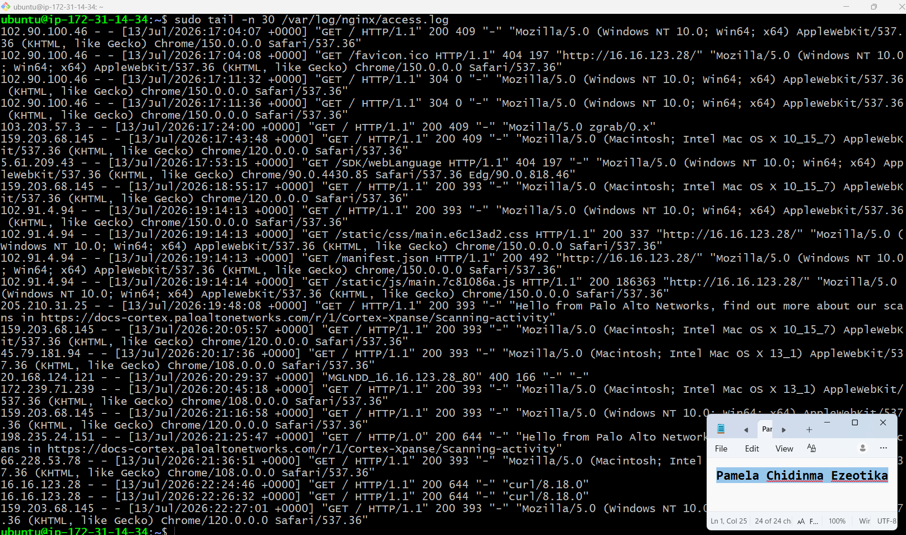

---

#### Screenshot 2 — Output of `sudo tail -n 30 /var/log/nginx/error.log`

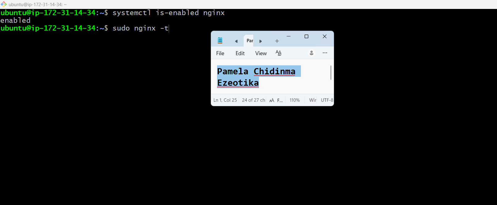

---

#### Screenshot 3 — Output of `sudo journalctl -u nginx --no-pager -n 50`

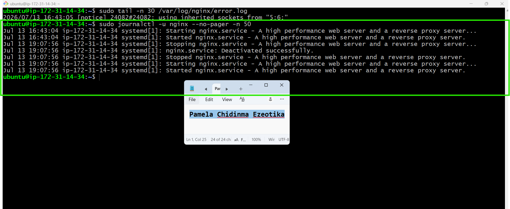

---

### Notes

Answer the following in your own words:

**1. Were there any errors in the logs?**

- If yes, mention 1–2 example error lines from the logs and explain what each one means in simple terms.
- If no, explain what it means if the error log is empty or shows no recent errors during your check.

Yes, there were a couple of lines with non-200 status codes, but none of them point to a real problem with the application.

---

**2. If there were no errors, what does that indicate about the system?**

An empty or error-free log means the server received requests and handled every one of them successfully, without crashing, timing out, or returning server-side failures. It's a strong sign that Nginx and the application underneath it are stable and functioning as expected. 

---

**3. Based on the access logs, were your curl requests visible in the log entries? What does that prove about traffic flow?**

Yes. The access log shows requests with the user agent curl/8.18.0. This proves that the server received the curl requests and recorded them in the access log, confirming that traffic is reaching the Nginx server successfully.

---

# Task 4 — System Resource Health Check (Capacity Red Flags)

## Goal

Assess server capacity and detect potential performance or failure risks.

### Evidence

#### Screenshot 1 — Output of `uptime`

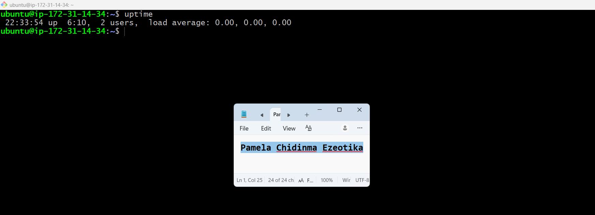

---

#### Screenshot 2 — Output of `free -h`

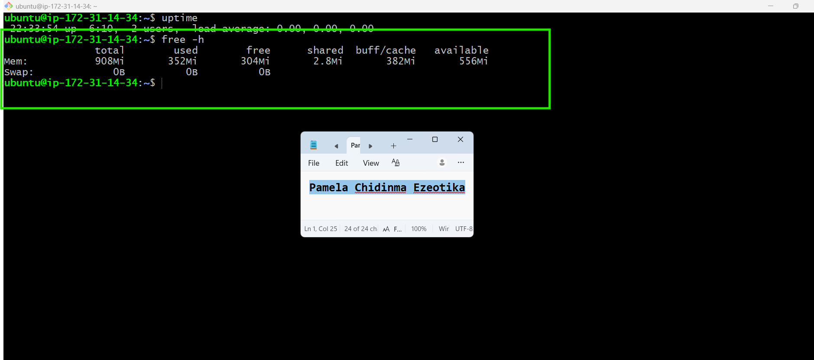

---

#### Screenshot 3 — Output of `df -h`

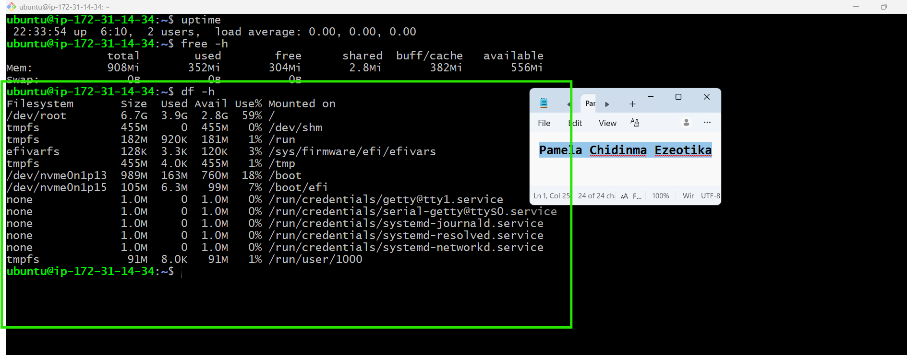

---

#### Screenshot 4 — Output of `sudo du -sh /var/* | sort -h`

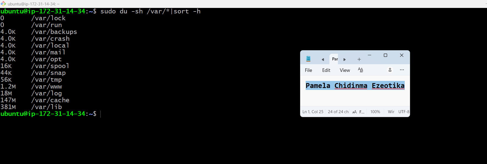

---

### Notes

Answer the following in your own words:

**1. Which resource looks most critical right now? (CPU/load, memory, or disk) Explain why.**

Disk

---

**2. What happens if disk becomes 100% full in a production server?**

If the disk becomes 100% full, the server may not be able to save files, write logs, or store application data. This can cause applications to fail, services to stop working properly.

---

# Task 5 — Configuration & Deployment Verification

## Goal

Ensure the correct React build is deployed and Nginx is serving it properly.

### Evidence

#### Screenshot 1 — Output of `ls -lah /var/www/html | head -n 20`

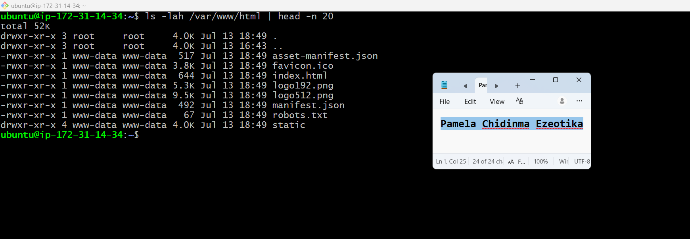

---

#### Screenshot 2 — Output of `grep -R "Deployed by" -n /var/www/html 2>/dev/null | head`

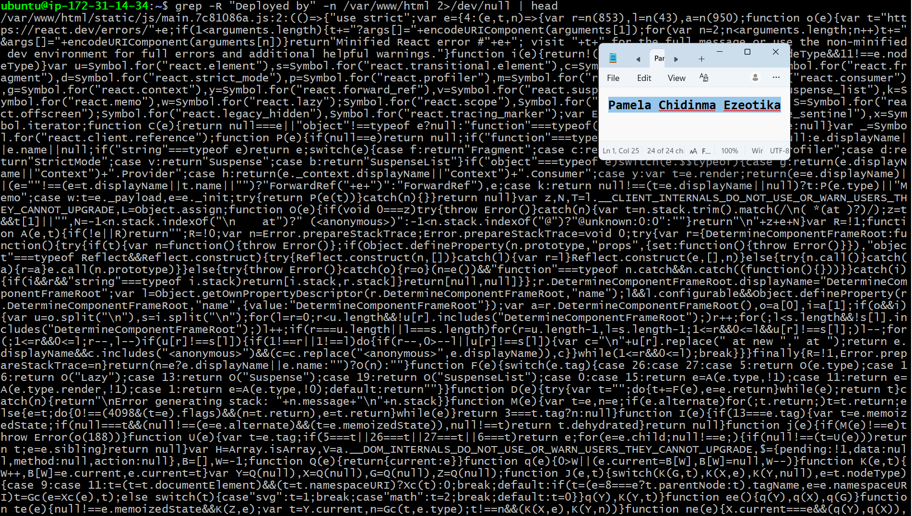
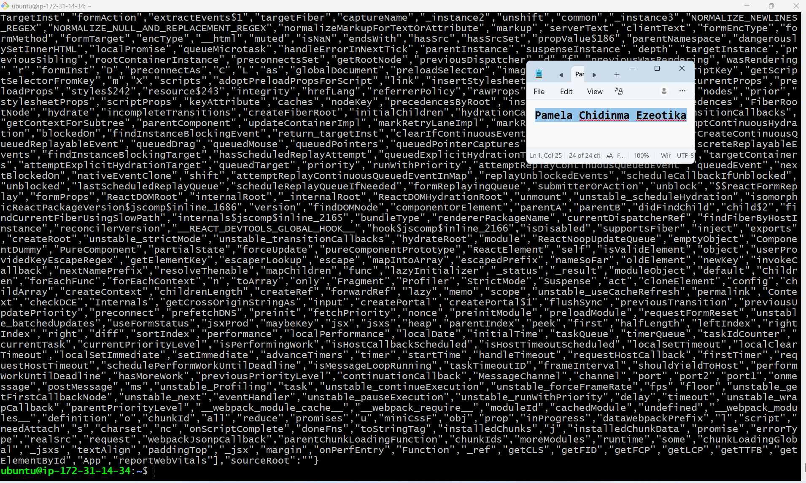
---

#### Screenshot 3 — Output of `grep -n "try_files" /etc/nginx/sites-available/default`

---

### Notes

Answer the following in your own words:

**1. How do you confirm that the correct version of the application is deployed?**

I confirm it by opening the application in a browser or using curl to check the version or the latest changes. If the application shows the expected update and works correctly, it means the correct version has been deployed.

---

# Task 6 — Nginx Configuration Failure Simulation

## Goal

Simulate a real-world Nginx misconfiguration and recover the service safely.

### Evidence

#### Screenshot 1 — Output of `sudo nginx -t` showing the syntax error (broken config)

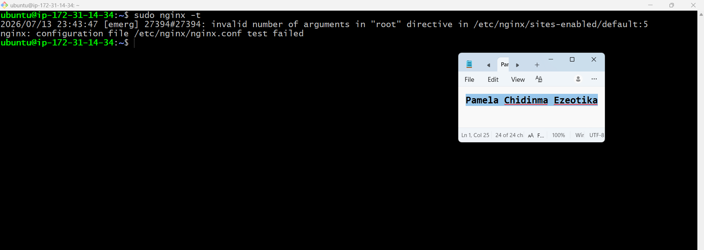

---

#### Screenshot 2 — Output of `sudo nginx -t` showing syntax ok (fixed config)

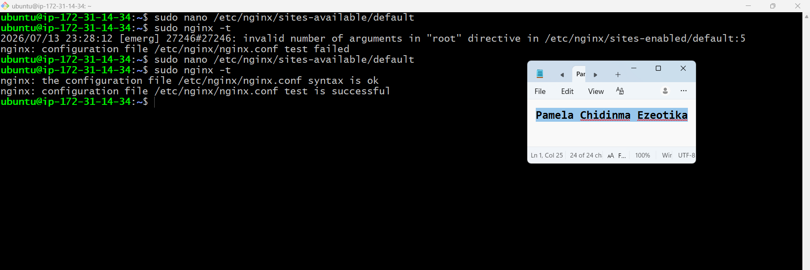

---

#### Screenshot 3 — Output of `curl -I http://<public-ip>` confirming recovery (200 OK)

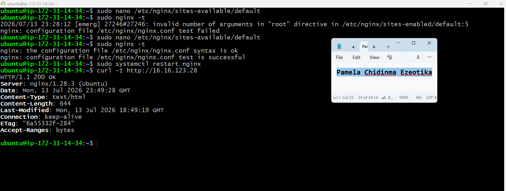

---

### Notes

Answer the following in your own words:

**1. What caused the configuration failure?**

The configuration failure happened because the semicolon (;) was removed from the try_files $uri /index.html; line in the Nginx configuration file. This caused a syntax error, so Nginx could not validate the configuration.

---

**2. How did you fix the issue?**

I fixed the issue by adding the missing semicolon back to the try_files line. After that, I ran sudo nginx -t to confirm the configuration was correct, restarted the Nginx service, and verified that the application was working again.

---

**3. How can you avoid this kind of issue in real production systems?**

To avoid this kind of issue, always test the Nginx configuration with sudo nginx -t before restarting the service. It is also good practice to review configuration changes carefully, keep backups of working configurations, and use version control so changes can be rolled back if needed.
---

# Task 7 — Web Application Failure Simulation

## Goal

Simulate missing deployment content and recover the application safely.

### Evidence

#### Screenshot 1 — Output of `curl -I http://<public-ip>` showing failure (non-200 response)

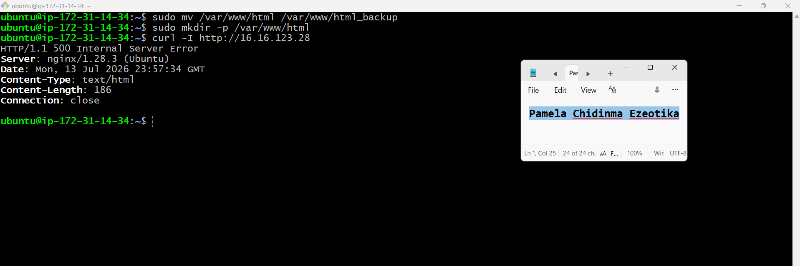

---

#### Screenshot 2 — Output of `curl -I http://<public-ip>` confirming recovery (200 OK)

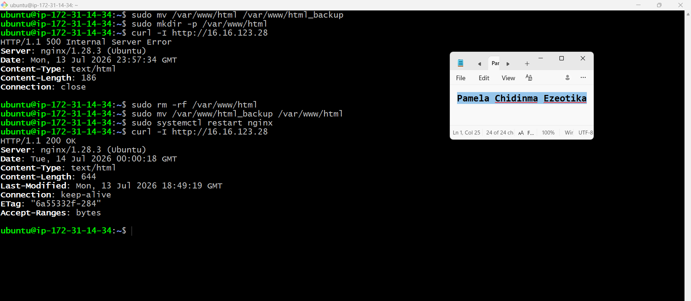

---

### Notes

Answer the following in your own words:

**1. What caused the application to break in this scenario?**

The application stopped working because the /var/www/html folder was removed and replaced with an empty folder. Since the website files were missing, Nginx could not serve the application.
---

**2. How did you fix the issue and restore the application?**

I restored the original /var/www/html folder from the backup, restarted the Nginx service, and checked the application again. After the files were restored, the application loaded successfully.

---

**3. What steps would you take to prevent this kind of issue in real production systems?**

I would always create a backup before making changes, test changes in a staging environment first, and use version control and deployment tools. This makes it easier to recover quickly if something goes wrong.

---

# Task 8 — Security & Reliability Review

## Goal

Review and reflect on the security and reliability practices applied during this assignment.

### Security & Reliability Notes

Answer the following in your own words:

**1. Why is SSH key-based authentication more secure than sharing passwords?**

SSH keys are more secure because they are much harder to guess or crack than passwords. They also reduce the risk of someone gaining access through stolen or weak passwords.

---

**2. Why should only required ports be open on a production server?**

Only the required ports should be open to reduce security risks. Closing unused ports helps prevent unauthorized access and reduces the chances of attacks.

---

**3. Why is it important for Nginx to be enabled on boot?**

Enabling Nginx on boot ensures that the web server starts automatically whenever the server restarts. This helps keep the application available without needing manual intervention.

---

**4. What are the risks of sharing secrets, keys, or credentials publicly?**

If secrets, keys, or credentials are shared publicly, attackers can use them to access servers, applications, or cloud resources. This can lead to data loss, security breaches, and unauthorized changes.

---

**5. Why should cloud resources be stopped or terminated when they are no longer needed?**

Unused cloud resources should be stopped or terminated to avoid unnecessary costs and reduce security risks. It also helps keep the cloud environment clean and easier to manage.

---

# LinkedIn Post (Required)

## Evidence

#### LinkedIn Post URL

https://www.linkedin.com/posts/pamela-ezeotika_configvalidation-testbeforedeploy-nginx-activity-7483033873354928128-PZBk?utm_source=share&utm_medium=member_desktop&rcm=ACoAAEDjJUYBrDNdac3TpJMBKPF08Q4-AeIrB8E

---

#### Screenshot — Published LinkedIn post

---

# Submission Instructions

- Add all required screenshots in your submission
- Full name must be visible in required screenshots
- Do not expose sensitive information (keys, passwords, account IDs)

---

# Completion Checklist

- [ ] Task 1: Screenshots (browser, ip a, ss -tulpen, ufw status) + Notes answered
- [ ] Task 2: Screenshots (nginx status, nginx -t, ss port 80) + Notes answered
- [ ] Task 3: Screenshots (access log, error log, journalctl) + Notes answered
- [ ] Task 4: Screenshots (uptime, free -h, df -h, du -sh) + Notes answered
- [ ] Task 5: Screenshots (ls html, grep deployed by, grep try_files) + Notes answered
- [ ] Task 6: Screenshots (nginx -t fail, nginx -t pass, curl recovery) + Notes answered
- [ ] Task 7: Screenshots (curl failure, curl recovery) + Notes answered
- [ ] Task 8: Security & Reliability Notes answered
- [ ] LinkedIn post published and URL submitted
- [ ] Full Name visible in all required screenshots
- [ ] No sensitive data exposed

---

## 📌 About DMI & CloudAdvisory

DevOps Micro Internship (DMI) is a project-based DevOps program run by Pravin Mishra (The CloudAdvisory) focused on real-world execution, systems thinking, and career readiness.

It helps learners build strong DevOps foundations with hands-on experience.

---

## 📌 Resources

- 🌐 DMI Official Website: https://pravinmishra.com/dmi  
- 🎓 DevOps for Beginners (Udemy): https://www.udemy.com/course/devops-for-beginners-docker-k8s-cloud-cicd-4-projects/  
- 🎓 Agentic AI DevOps with Claude Code: https://www.udemy.com/course/ultimate-agentic-ai-devops-with-claude-code/  
- 🎓 DevOps with Claude Code: Terraform, EKS, ArgoCD & Helm: https://www.udemy.com/course/devops-with-claude-code-terraform-eks-argocd-helm/  
- ▶️ YouTube Playlist: https://www.youtube.com/playlist?list=PLFeSNDtI4Cho  
- 🔗 Pravin Mishra (LinkedIn): https://www.linkedin.com/in/pravin-mishra-aws-trainer/  
- 🏢 CloudAdvisory (LinkedIn): https://www.linkedin.com/company/thecloudadvisory/

---

*This submission is part of DevOps Micro Internship (DMI) Cohort 3 — Agentic AI Track.*