# Assignment 5 — Bash Script Automation Drill (OPS Checklist)

Part of the DevOps Micro Internship (DMI) Cohort 3 with Agentic AI

---

## Purpose

In this assignment, you will practice Bash scripting by building a series of small automation scripts covering environment setup, variables, arrays, loops, file conditionals, if-else logic, and functions. These scripts form the foundation of real-world Linux automation used in DevOps, cloud, and production support environments.

---

# Task 1 — Bash Environment & Workspace Setup

## Goal

Verify that Bash is available on your system and create a clean workspace for this assignment.

### Evidence

#### Screenshot 1 — Output of `echo $SHELL` and `bash --version`

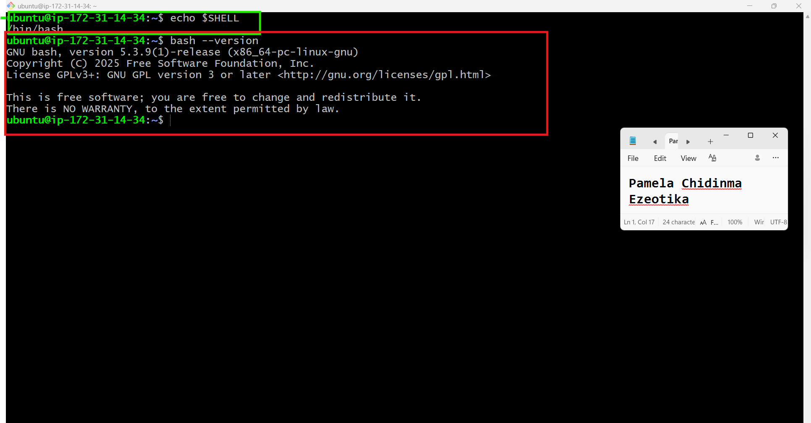

---

#### Screenshot 2 — Output of `pwd` and `ls -lah` showing the scripts directory

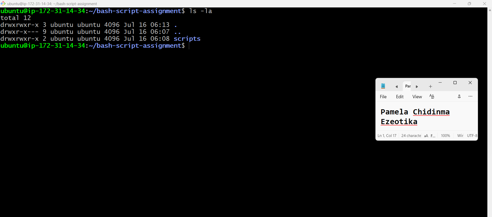

---

### Notes

Answer the following in your own words:

**1. What is Bash?**

Bash is a command-line shell that lets you interact with the Linux operating system. It is also used to write scripts that automate tasks.

---

**2. What is the difference between shell and Bash?**

A shell is a program that lets you communicate with the operating system. Bash is one type of shell and is one of the most commonly used shells on Linux.

---

**3. Why is it important to confirm the Bash version before writing scripts?**

It is important to confirm the Bash version because some script features may only work in certain versions. Checking the version helps make sure the script runs correctly on your system.

---

# Task 2 — Your First Bash Script

## Goal

Create your first Bash script, make it executable, and run it from the terminal.

### Evidence

#### Screenshot 1 — Content of `first-script.sh`

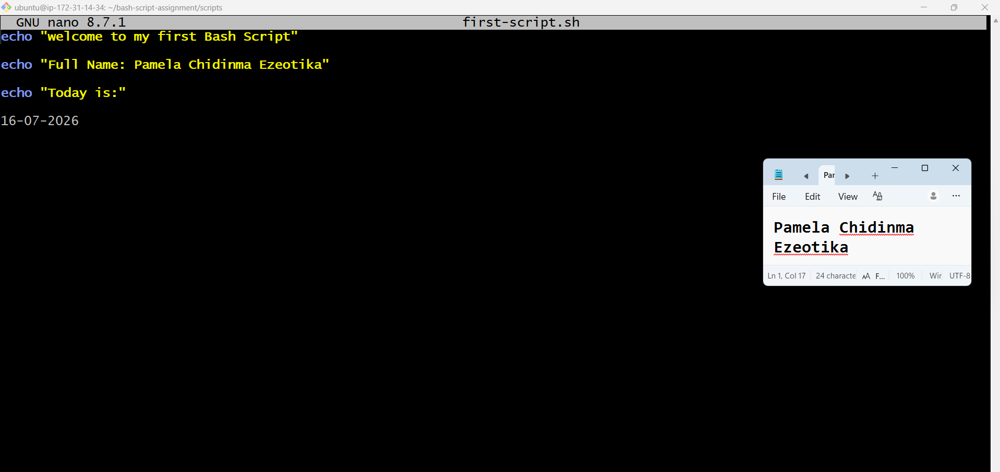

---

#### Screenshot 2 — Output of `./first-script.sh`

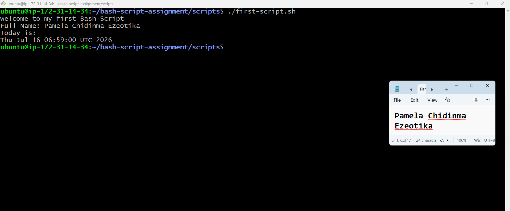

---

#### Screenshot 3 — Output of `ls -l first-script.sh` showing executable permission

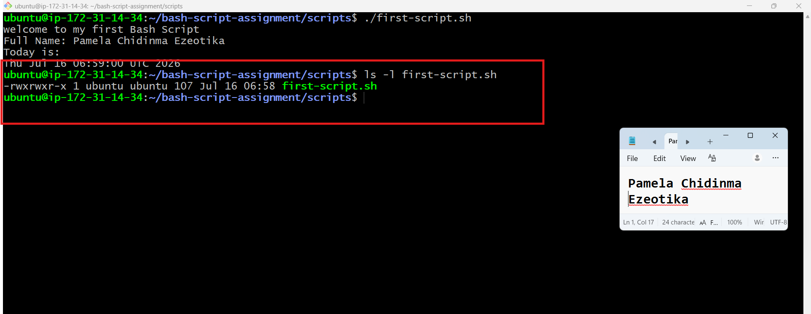

---

### Notes

Answer the following in your own words:

**1. What is the purpose of `#!/bin/bash`?**

#!/bin/bash tells the system to use the Bash shell to run the script. It makes sure the script is executed with Bash.

---

**2. Why do we use `chmod +x` before running a script?**

We use chmod +x to make the script executable. This gives the script permission to run as a program.

---

**3. What is the difference between running a script using `./script.sh` and `bash script.sh`?**

./script.sh runs the script as an executable file, so it needs execute permission (chmod +x) and uses the interpreter specified by #!/bin/bash.
bash script.sh runs the script directly with the Bash program, so it does not need execute permission, as long as the file can be read.

---

# Task 3 — Variables: User Information Script

## Goal

Use variables to store and display user-related information.

### Evidence

#### Screenshot 1 — Content of `user-info.sh`

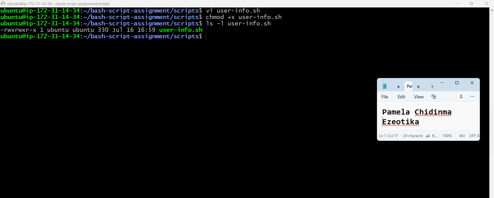

---

#### Screenshot 2 — Output of `./user-info.sh`

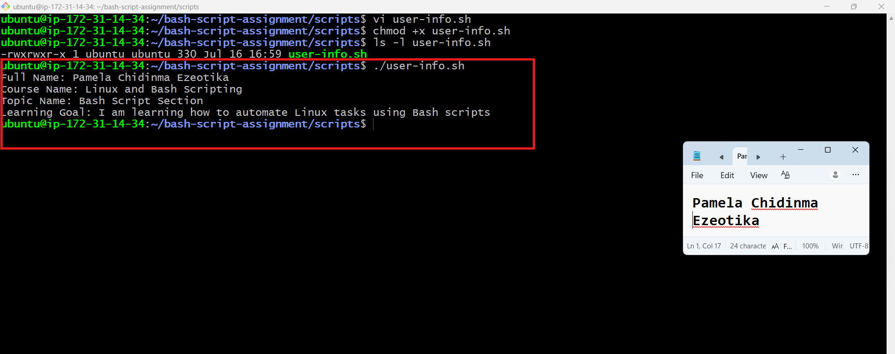

---

### Notes

Answer the following in your own words:

**1. What is a variable in Bash?**

A variable in Bash is a name used to store a value, such as text, numbers, or the result of a command, so it can be used later in the script.

---

**2. Why should we avoid spaces around the `=` sign when creating variables?**

We should not use spaces around the = sign because Bash will not recognize it as a variable assignment and the script may give an error.

---

**3. How do you access the value stored inside a Bash variable?**

The value of a variable is accessed using the $ symbol followed by the variable name, for example $full_name..

---

# Task 4 — Arrays & Loops: Tools Checklist Script

## Goal

Use arrays and loops to print a checklist of tools used in Bash scripting.

### Evidence

#### Screenshot 1 — Content of `tools-checklist.sh`

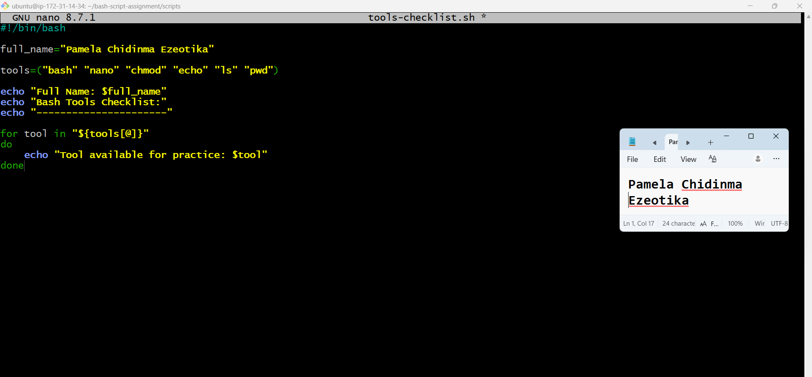

---

#### Screenshot 2 — Output of `./tools-checklist.sh`

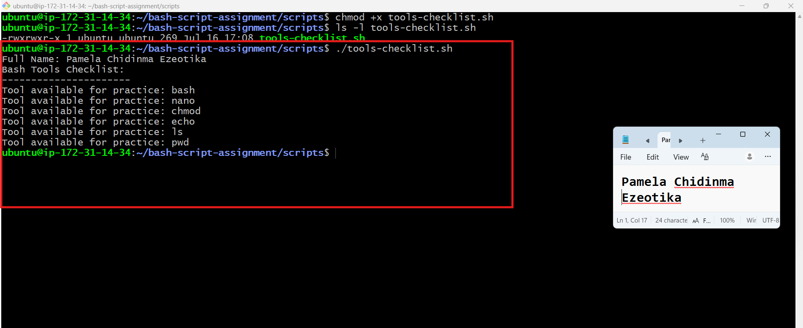

---

### Notes

Answer the following in your own words:

**1. What is an array in Bash?**

An array in Bash is a variable that can store more than one value in a single place.

---

**2. Why are arrays useful in scripts?**

Arrays make it easy to store and work with a group of related items without creating many separate variables.

---

**3. What does `"${tools[@]}"` mean?**

"${tools[@]}" means all the values stored in the tools array. It is used when you want to go through every item in the array.

---

**4. What is the purpose of the `for` loop in this script?**

The for loop goes through each item in the array one by one and performs the same action on each item. This saves time and avoids repeating the same code.

---

# Task 5 — Loops: Number Counter Script

## Goal

Use loops to repeat a task multiple times.

### Evidence

#### Screenshot 1 — Content of `counter.sh`

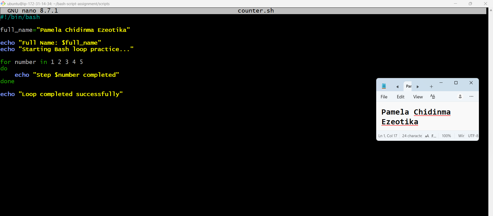

---

#### Screenshot 2 — Output of `./counter.sh`

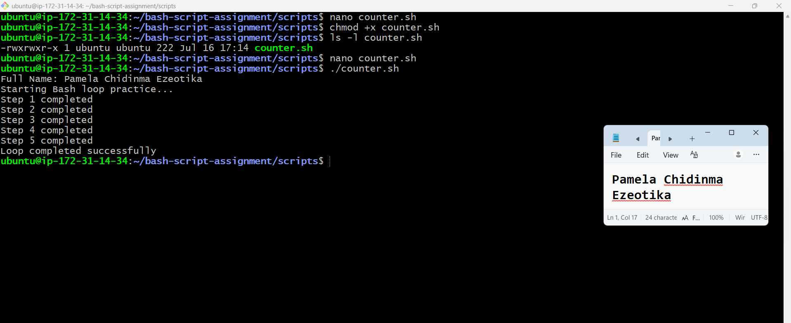

---

### Notes

Answer the following in your own words:

**1. What is a loop?**

A loop is a programming feature that repeats the same set of commands multiple times.

---

**2. Why do we use loops in Bash scripting?**

We use loops to repeat tasks automatically. This makes the script shorter, faster, and easier to manage.

---

**3. How many times did the loop run in your script?**

The loop ran 5 times because the checks array contained five health check functions.

---

**4. What would you change if you wanted the loop to run 10 times?**

I would change the script so that the loop repeats 10 times, for example by setting the loop to count from 1 to 10, or by adding 10 items to the array if the loop is based on an array.

---

# Task 6 — Files & Conditionals: File Validation Script

## Goal

Use file checks and conditionals to verify whether files and directories exist.

### Evidence

#### Screenshot 1 — Output of `ls -lah ../test-folder`

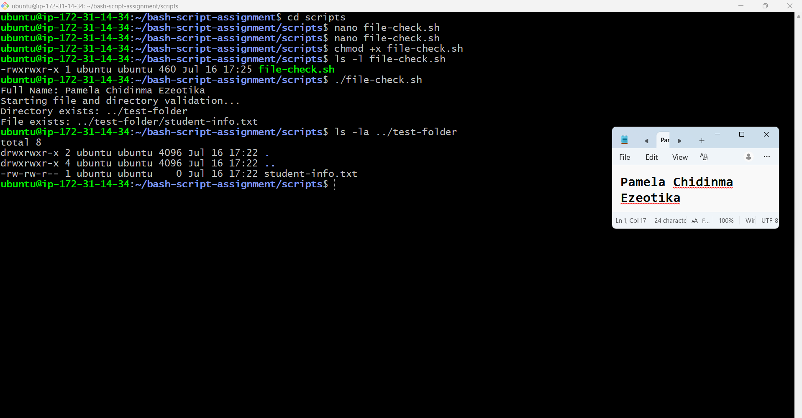

---

#### Screenshot 2 — Content of `file-check.sh`

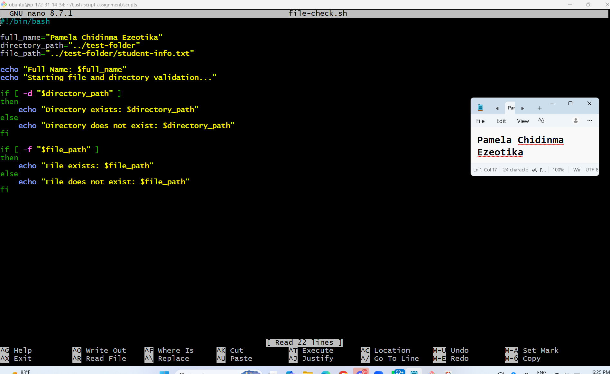

---

#### Screenshot 3 — Output of `./file-check.sh`

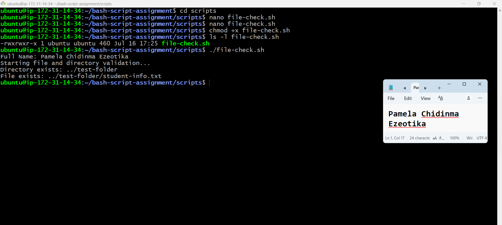

---

### Notes

Answer the following in your own words:

**1. What does `-d` check in Bash?**

-d checks if a directory exists.

---

**2. What does `-f` check in Bash?**

-f checks if a file exists and is a regular file.

---

**3. Why should file and directory paths be stored in variables?**

Storing paths in variables makes the script easier to read and update. If the path changes, you only need to change it in one place.

---

**4. What happens if the file does not exist?**

If the file does not exist, the script can show an error message or take another action, depending on how it is written.

---

# Task 7 — Conditionals: Pass or Retry Script

## Goal

Use if-else conditionals to make decisions based on a variable value.

### Evidence

#### Screenshot 1 — Content of `score-check.sh` with `score=85`

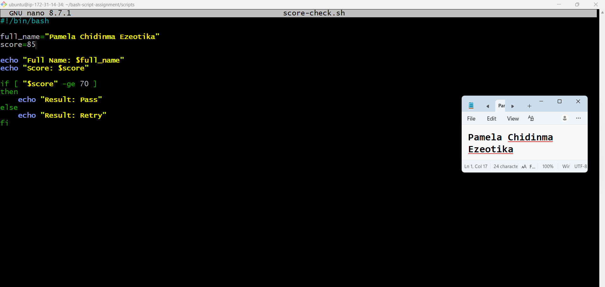

---

#### Screenshot 2 — Output showing `Result: Pass`

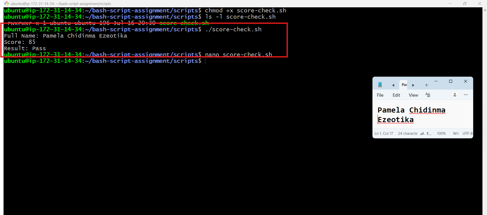

---

#### Screenshot 3 — Content of `score-check.sh` with `score=55`

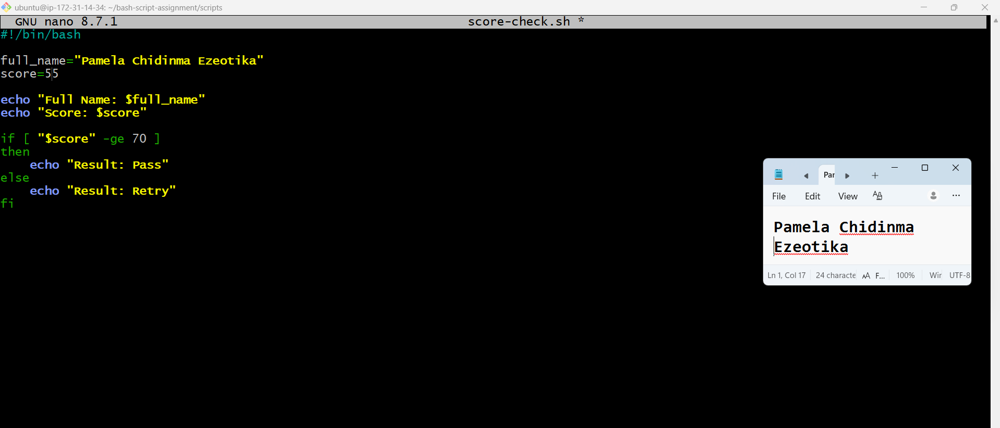

---

#### Screenshot 4 — Output showing `Result: Retry`

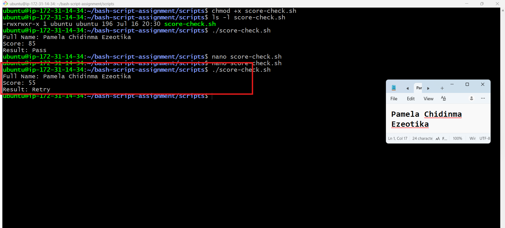

---

### Notes

Answer the following in your own words:

**1. What is the purpose of if-else in Bash?**

The if-else statement is used to make decisions. It runs one block of code if the condition is true and another block if the condition is false.

---

**2. What does `-ge` mean?**

-ge means greater than or equal to. It is used to compare two numbers.

---

**3. Why should conditions be tested with different values?**

Testing different values helps make sure the script works correctly in different situations and gives the expected result.

---

**4. How can conditionals help in automation scripts?**

Conditionals help the script make decisions automatically, such as checking for errors, running different commands, or responding to different situations without manual input.

---

# Task 8 — Functions: Final Bash Automation Script

## Goal

Create a final Bash script using functions to organize reusable code.

### Evidence

#### Screenshot 1 — Content of `final-automation.sh`

Add your screenshot here.

---

#### Screenshot 2 — Output of `./final-automation.sh`

Add your screenshot here.

---

#### Screenshot 3 — Output of `ls -lah` showing all created scripts

Add your screenshot here.

---

### Notes

Answer the following in your own words:

**1. What is a function in Bash?**

A function in Bash is a block of code that performs a specific task. You can call the function whenever you need it instead of writing the same code again.

---

**2. Why are functions useful in scripts?**

Functions make scripts easier to read, organize, and maintain. They also reduce repeated code and make updates easier.

---

**3. Which functions did you create in this script?**

In this script, I created the following functions:

check_service()
check_port()
check_http()
check_disk()
check_memory()

---

**4. How does this final script combine variables, arrays, loops, conditionals, files, and functions?**

The script uses variables to store values like the service name and report path, an array to store the health check functions, a loop to run each check, conditionals to decide whether a check passes or fails, files to save the health report, and functions to organize each health check into separate reusable blocks. Together, these make the script organized, reusable, and easy to maintain.

---

# LinkedIn Post (Required)

## Evidence

#### LinkedIn Post URL

Paste your LinkedIn post URL here:

`Add your URL here`

---

#### Screenshot — Published LinkedIn post

Add your screenshot here.

---

# Submission Instructions

- Add all required screenshots in your submission
- Full name must be visible in required screenshots
- All script files must be created and run successfully
- Required notes must be answered clearly for every task
- Do not expose sensitive information (keys, passwords, credentials)

---

# Completion Checklist

- [ ] Task 1: Environment setup verified, workspace created (Screenshots 1–2, Notes answered)
- [ ] Task 2: First script created, executed, permissions verified (Screenshots 1–3, Notes answered)
- [ ] Task 3: Variables script created and run (Screenshots 1–2, Notes answered)
- [ ] Task 4: Arrays and loops script created and run (Screenshots 1–2, Notes answered)
- [ ] Task 5: Counter loop script created and run (Screenshots 1–2, Notes answered)
- [ ] Task 6: File validation script created and run (Screenshots 1–3, Notes answered)
- [ ] Task 7: Pass/Retry conditional script tested with both values (Screenshots 1–4, Notes answered)
- [ ] Task 8: Final automation script created and run (Screenshots 1–3, Notes answered)
- [ ] All scripts run without errors
- [ ] Full Name visible in all required screenshots
- [ ] LinkedIn post published and URL submitted
- [ ] No sensitive data exposed

---

## 📌 About DMI & CloudAdvisory

DevOps Micro Internship (DMI) is a project-based DevOps program run by Pravin Mishra (The CloudAdvisory) focused on real-world execution, systems thinking, and career readiness.

It helps learners build strong DevOps foundations with hands-on experience.

---

## 📌 Resources

- 🌐 DMI Official Website: https://pravinmishra.com/dmi  
- 🎓 DevOps for Beginners (Udemy): https://www.udemy.com/course/devops-for-beginners-docker-k8s-cloud-cicd-4-projects/  
- 🎓 Agentic AI DevOps with Claude Code: https://www.udemy.com/course/ultimate-agentic-ai-devops-with-claude-code/  
- 🎓 DevOps with Claude Code: Terraform, EKS, ArgoCD & Helm: https://www.udemy.com/course/devops-with-claude-code-terraform-eks-argocd-helm/  
- ▶️ YouTube Playlist: https://www.youtube.com/playlist?list=PLFeSNDtI4Cho  
- 🔗 Pravin Mishra (LinkedIn): https://www.linkedin.com/in/pravin-mishra-aws-trainer/  
- 🏢 CloudAdvisory (LinkedIn): https://www.linkedin.com/company/thecloudadvisory/

---

*This submission is part of DevOps Micro Internship (DMI) Cohort 3 — Agentic AI Track.*